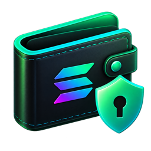

<div align="center">



# LocalWallet

**A local Solana wallet manager for people who hold more than one.**
Encrypted on your machine. Keys never leave it.

[](LICENSE)
[](https://github.com/berkayoztunc/LocalWallet/releases)
[](https://github.com/berkayoztunc/LocalWallet/actions/workflows/ci.yml)
[](https://github.com/berkayoztunc/LocalWallet/releases)

</div>

---

## Why

Browser wallets are built around one account at a time. The moment you keep a few keys — a trading wallet, an airdrop set, leftovers from a mint, wallets you inherited from an old script — the basics get tedious: switch, check, switch back. Nobody audits balances they can't see on one screen.

There's also money quietly sitting still. Every SPL token account holds about **0.002 SOL** in rent, refundable once it's empty. A wallet that has traded a handful of tokens is often holding more in reclaimable rent than in SOL — and if it's been emptied, it can't even pay the fee to get that back.

LocalWallet puts every wallet you own on one screen, does the tedious parts in bulk, and keeps the keys on your machine while it does.

**Good fit if you:** hold several wallets and want one view · are cleaning up after a bot, mint or airdrop farm · want to consolidate scattered SOL · want your keys encrypted locally rather than in a browser extension.

**Not for you if:** you have one wallet and Phantom already does the job · you want a hot wallet for daily dApp use — this signs transfers and account closures, nothing else.

## Features

| | |
|---|---|
| **Encrypted vault** | Argon2id + XChaCha20-Poly1305. One master password, set on first run. |
| **Bulk balances** | Every wallet's SOL at once, batched so a hundred wallets cost one RPC call rather than a hundred. |
| **Token inventory** | Every token account across SPL Token and Token-2022, with balances, and how much rent is reclaimable. |
| **Close unused accounts** | Reclaim rent from zero-balance token accounts. Built and signed locally — no third-party service, no fee taken. |
| **Fund → close → return** | Lend an empty wallet a fee, close its accounts, send the proceeds on. Releases rent that would otherwise be unreachable. |
| **Collect all SOL** | Drain every wallet into one destination, with a per-wallet preview first. |
| **Send SOL** | Single transfers from any wallet, with a quote before you sign. |
| **Private send** | Shield SOL into the [Privacy Cash](https://privacycash.org) pool, pay any address out of it, and unshield the rest back to a wallet of your own. Opt-in, third-party, mainnet only — [read this first](#private-send-privacy-cash). |
| **Shielded balances** | A **Pool** column showing what each wallet holds in Privacy Cash, scanned per row on request. |
| **Hidden addresses** | The wallet list masks every address by default. One toggle reveals them; copying works either way. |
| **Stake** | Every stake account your wallets control, with per-row unstake and withdraw, staking to any validator, plus a browsable list of all validators. |
| **Tray total** | `163.40 SOL · $12,440` on the menu bar (macOS), the panel (Linux) or on hover (Windows), updated whenever balances refresh. Optional. |
| **Configurable** | Your own RPC endpoint, commitment level, priority fee, concurrency, and a choice of Solana Explorer, Solscan or Orb. |

## Security

Read this part.

- **Your keys never reach the interface.** All key material stays in Rust: decrypt → sign → zeroize. The UI only ever receives public keys, balances and signatures. No command in the app can return a private key.
- **The vault file leaks nothing.** Argon2id (64 MiB, 3 passes) derives the key; the whole wallet list is sealed with XChaCha20-Poly1305 under a fresh nonce on every save. Not the wallet count, not the labels — only the KDF parameters are readable, because they're needed to re-derive the key. A test asserts no plaintext key material appears in the file.
- **No password recovery.** A wrong password simply fails the AEAD check; no password hash is stored anywhere. Export a backup and keep the password somewhere safe.
- **No telemetry.** The app talks to the RPC endpoint you configure. The one exception is the validator directory used by the Stake screen — see [Network access](#network-access) — which is a single, disableable request that sends no address and no key.

> [!WARNING]
> **This is unaudited software that holds private keys.** It has not been reviewed by a third party. Use it for wallets you own, start on devnet, and try a single low-value wallet on mainnet before pointing it at everything you have. You are responsible for your own keys.

### Network access

| Request | Host | Sends | Optional |
|---|---|---|---|
| All chain data and transactions | **your configured RPC** | addresses, signed transactions | no — it is how the app works |
| Validator names, icons, APY | **api.stakewiz.com** | nothing but the request itself and your IP | **yes** — Settings → Explorer → uncheck |
| SOL price for the menu bar | **api.coingecko.com** | nothing but the request itself and your IP | **yes** — Settings → Security → uncheck |
| Private sends | **api3.privacycash.org** | pool notes, proofs, recipient address | **yes** — only if you open the Privacy Cash dialog |

The directory and price calls never include an address, a balance or a key. The directory is fetched only on the Stake screen's Validators tab and cached for six hours; the price is fetched at most once a minute.

Privacy Cash is the exception, and the only feature that sends anything meaningful to a third party — it cannot work otherwise, which is why it sits behind its own warning and does nothing until you open it. With all three off, the app makes no request to any host other than your RPC.

### Private send (Privacy Cash)

Every other feature in this app moves funds between addresses you control, in the open. This one does not, so it deserves its own paragraph.

[Privacy Cash](https://privacycash.org) is a shielded pool: a deposit hands SOL to a contract and records an encrypted note only you can read, and a withdrawal proves in zero knowledge that *some* unspent note exists without revealing which. The address paid by a withdrawal therefore cannot be tied to the address that deposited. **Shield** puts SOL in, **Private send** pays anyone out of it, and **Unshield** aims the same withdrawal back at one of your own wallets.

What you are agreeing to when you use it:

- **It is someone else's contract.** LocalWallet has not audited it (the SDK reports an audit by Zigtur). If the pool fails, the funds in it are gone — no key in your vault recovers them.
- **A relayer submits withdrawals** and charges a fee — currently 0.35% plus a flat ~0.006 SOL, quoted live before you confirm, minimum 0.01 SOL. It never holds your funds, but it does see the recipient.
- **Mainnet only.** Privacy Cash has no devnet deployment, so there is nothing to rehearse on. Start with an amount you would not mind losing.
- **Privacy is not automatic.** It comes from the size of the pool and from time. Depositing and immediately withdrawing the same unusual amount links both ends by itself.
- **Balances are read one wallet at a time.** The pool does not record whose notes are whose, so finding a wallet's balance means trying every note in it — currently ~750,000, about 130 MB — against that wallet's key. That is why the **Pool** column scans on request per row rather than filling in with the others, and why there is no bulk version: N wallets would mean N passes over the whole pool. Repeat scans of the same wallet resume from where the last one stopped.

- **Shielded funds are guarded differently from the rest of your wallet.** Everywhere else in this app, your keys stay in the Rust backend and the interface only ever sees public data. That still holds for the raw key here — proof generation is a JavaScript and WASM library driven through the SDK's external-signer entry points, so the secret key itself never reaches the interface. But the signature it *does* receive is what the pool's spending key is derived from, and a withdrawal is authorised by that key rather than by a wallet signature — so the code running in the app window necessarily holds enough to move your shielded balance while it has that signature. That cannot be otherwise while the prover runs there.

  What can be, and is, bounded: a native **system dialog** — not something the app's own JavaScript draws — names the wallet and asks you to approve Privacy Cash for it before any signature is issued, one wallet at a time, for **15 minutes**, and locking the vault ends that window immediately. A copy that leaks during those 15 minutes is still a copy of a bearer credential, though, and the shielded pool has no password to change out from under it — so the honest version is that your ordinary SOL is safe from a bad npm release in a way the amount you have shielded, during that window, is not. Keep it to what you would accept losing. The note encryption key is otherwise the same one Privacy Cash's own web app derives, so the same wallet shows the same private balance in either.

`node scripts/simulate-privacy.mjs` exercises the whole path — key derivation, live relayer fees, pool scanning, and optionally building and *simulating* a real deposit — without ever submitting a transaction.

Everything that describes your money — stake amounts, commissions, delinquency — comes from your own RPC either way. The directory supplies names only.

## Install

Grab the build for your platform from [**Releases**](https://github.com/berkayoztunc/LocalWallet/releases). The Windows installer is code-signed and the Linux artifacts are GPG-signed. The macOS build is only ad-hoc signed — enough to run, but not attributable to a developer — so it has a first-run hurdle; details below.

### macOS (Apple Silicon)

Download the `.dmg`, open it, and drag **LocalWallet** to Applications.

macOS will refuse to open it the first time, saying it *cannot be opened because Apple cannot check it for malicious software*. The app carries an ad-hoc signature but **not an Apple Developer ID**, so Gatekeeper cannot attribute it to anyone — expected for open-source software distributed outside the App Store. Pick either:

**Through System Settings** — double-click the app, dismiss the warning, then open **System Settings → Privacy & Security**, scroll down, and click **Open Anyway**. macOS remembers the choice.

**Or in one command:**

```bash
xattr -dr com.apple.quarantine /Applications/LocalWallet.app
```

This strips the quarantine flag macOS adds to downloaded files. It is the same thing the Settings button does, without the round trip.

> On macOS 15 and later, right-clicking the app and choosing *Open* no longer bypasses this — Apple removed that path. Use one of the two above.

> [!NOTE]
> If macOS instead says the app **“is damaged and can’t be opened”**, with only a *Move to Trash* button, you have a release **before v0.3.0**. Those were bundled with no valid signature at all, and Gatekeeper reports a malformed signature as damage. The download is fine — run the `xattr` command above, or update to v0.3.0 or later.

Building from source avoids the warning entirely, since locally built apps are never quarantined.

Apple Silicon only for now.

### Windows (x64)

Download the `.exe` setup and run it. It is signed with a certificate from [SignPath Foundation](https://signpath.org) — the UAC prompt should name them as the publisher.

SmartScreen builds reputation per certificate over time, so a new release may still show *Windows protected your PC* even though the installer is signed. If it does, check the publisher in the UAC prompt before clicking **More info → Run anyway**. An installer with no publisher, or a different one, did not come from here.

Windows tray icons cannot carry text, so the total appears when you hover the icon rather than beside it. Everything else works the same.

### Linux (x64)

Two formats, both x86-64:

```bash
# AppImage — runs anywhere, nothing to install
chmod +x LocalWallet_*.AppImage
./LocalWallet_*.AppImage

# .deb — Debian, Ubuntu and derivatives
sudo apt install ./LocalWallet_*.deb
```

The tray total needs a desktop that speaks AppIndicator. KDE, Cinnamon, Budgie and Unity do out of the box; **GNOME does not** — install the [AppIndicator and KStatusNotifierItem Support](https://extensions.gnome.org/extension/615/appindicator-support/) extension. Without a tray the app still works fully; closing the window then quits it rather than hiding it to an icon that is not there.

#### Verifying a Linux download

Each release carries a `SHA256SUMS` file and a detached `SHA256SUMS.asc` signature, plus a `.asc` per artifact. The signing key fingerprint is:

<!-- Replace with the real fingerprint once the release signing key exists. -->
```
(not yet published — the release signing key is being set up)
```

```bash
gpg --recv-keys <FINGERPRINT>                  # once, from a keyserver
gpg --verify SHA256SUMS.asc SHA256SUMS         # is the list genuine?
sha256sum --ignore-missing -c SHA256SUMS       # do the files match it?
```

The first command establishes that the checksum list came from this project; the second that your download matches the list. Both matter — a checksum you downloaded alongside the file proves nothing on its own.

The AppImage also carries an embedded signature, but **AppImage does not check it** when running, so treat the detached signature above as the real verification path.

## Getting started

1. **Set a master password.** There is no recovery — the app makes you acknowledge that.
2. **Import your keys.** Paste them one per line, or many separated by commas. Both formats work and can be mixed:
   - base58 secret key (Phantom / Solflare export)
   - JSON byte array (`solana-keygen`, `id.json`)
3. **Set an RPC endpoint.** The default public endpoint is fine for a handful of wallets; past that it rate-limits. Use a dedicated provider (Helius, QuickNode, Triton), or a devnet URL to practise. There's a **Test** button next to the field.
4. **Scan tokens** to see what rent is recoverable.
5. **Close accounts** — or **Fund & close** for wallets too empty to pay their own fee.
6. **Collect all SOL** into one destination. It shows a full preview and makes you retype the destination address before anything is signed.

## How it works

<details>
<summary><b>Why an empty wallet can't close its own token accounts</b></summary>

Closing a token account is a transaction, and transactions need a fee payer. A wallet swept to zero has nothing to pay with — even though the account it wants to close holds 0.00204 SOL that would land in that same wallet.

Two Solana rules make this sharper than it looks:

1. An account may not hold a **non-zero balance below the rent-exempt minimum** (890,880 lamports for a plain wallet). Funding an empty wallet with "just enough for fees" is rejected outright.
2. The runtime validates the fee payer on `balance − fee` **before instructions execute**. The rent the close is about to return doesn't count yet. So a wallet funded to *exactly* the minimum still can't pay for anything.

**Fund & close** handles both: it lends the rent-exempt minimum *plus* every fee the wallet will spend (~0.00095 SOL), closes the accounts, then drains the wallet to your destination. Three transactions, each waiting for the previous to confirm. The loan comes back with the rent.

</details>

<details>
<summary><b>Why some accounts can't be closed</b></summary>

`CloseAccount` validates the signer against `close_authority.unwrap_or(owner)`. When a token's creator sets a **close authority** pointing at themselves, only they can close it and claim the rent — your signature is rejected with `OwnerMismatch`.

Spam and airdrop tokens do this routinely. LocalWallet detects them during the scan, marks them **locked** in the UI, and excludes their rent from the reclaimable total rather than burning fees on transactions that cannot succeed. That rent is not recoverable by you, and no tool can change that.

</details>

<details>
<summary><b>Unstaking, and why it takes days</b></summary>

Deactivating a stake account starts a cooldown that ends with the epoch — roughly two to three days. Only then can the SOL be withdrawn. The Stake screen shows each account's state (`activating`, `active`, `deactivating`, `inactive`) and keeps the withdraw action disabled, with the epoch it unlocks in the tooltip, until it will actually succeed.

Deactivating and withdrawing use different authorities. If your vault holds one but not the other, the action it cannot authorise is disabled and says so, rather than failing on chain.

</details>

<details>
<summary><b>How a private send keeps keys out of the interface</b></summary>

Zero-knowledge proving for Privacy Cash exists only as JavaScript and WASM, so it has to run in the webview — the one place this app otherwise never puts anything sensitive. Its high-level client wants the raw secret key handed to it, which would end the guarantee the rest of the app is built on.

It is not used. The integration drives the SDK's lower-level entry points instead, which take an external signer, so the split becomes:

| Step | Where it runs | What crosses the bridge |
|---|---|---|
| Derive the note encryption key | webview, from a signature | the message out, 64 signature bytes back |
| Build the deposit, prove, encrypt notes | webview | nothing |
| Sign the deposit | **Rust** (`privacy.rs`) | an unsigned transaction out, a signed one back |
| Submit the deposit | webview, via your RPC | — |
| Withdraw | webview + relayer | no signature exists to give — the proof authorizes it |

The backend signs exactly two things and refuses everything else: the one fixed sign-in message, checked byte for byte, and a transaction that already names the wallet as a required signer. Both are covered by tests in `src-tauri/src/privacy.rs`. A general "sign these bytes" command would be a signing oracle reachable from the interface, which is the thing worth not building.

</details>

<details>
<summary><b>Where your data lives</b></summary>

| Platform | Directory |
|---|---|
| macOS | `~/Library/Application Support/com.localwallet.app/` |
| Linux | `~/.local/share/com.localwallet.app/` |
| Windows | `%APPDATA%\com.localwallet.app\` |

| File | Contents |
|---|---|
| `vault.bin` | Encrypted keypairs |
| `settings.json` | Cleartext, non-sensitive: RPC URL, destination, explorer, concurrency |
| `menubar.json` | **Cleartext: your last known total in SOL and USD.** Written only while the tray total is enabled, so it can still show a number when the vault is locked. This is the one place holdings information lives outside the encrypted vault — disable the tray total in Settings to delete it. |

Reinstalling the app never touches this directory — the path is derived from the bundle identifier, not the app bundle.

</details>

## Build from source

Requires [Node.js](https://nodejs.org) (LTS) and [Rust](https://rustup.rs) everywhere, plus per platform:

- **macOS** — Xcode Command Line Tools (`xcode-select --install`)
- **Windows** — [Microsoft C++ Build Tools](https://visualstudio.microsoft.com/visual-cpp-build-tools/) and [WebView2](https://developer.microsoft.com/microsoft-edge/webview2/) (already present on Windows 11)
- **Linux** — `libwebkit2gtk-4.1-dev libayatana-appindicator3-dev libgtk-3-dev librsvg2-dev patchelf build-essential libssl-dev pkg-config`

```bash
git clone https://github.com/berkayoztunc/LocalWallet.git
cd LocalWallet
npm install

npm run tauri dev      # hot-reloading dev build
npm run tauri build    # installers in src-tauri/target/release/bundle/
cargo test --manifest-path src-tauri/Cargo.toml

node scripts/simulate-privacy.mjs   # private-send checks, submits nothing
```

Node 24 or newer is required: Privacy Cash's SDK will not install or run below it.

Release builds for all three platforms are produced by GitHub Actions — see `.github/workflows/release.yml`. Nothing has to be built locally to cut a release.

Signing runs in CI too, and stays inert until its secrets exist, so a fork builds exactly as this repo did before signing was added:

| Secret / variable | Kind | Purpose |
|---|---|---|
| `SIGNPATH_API_TOKEN` | secret | SignPath API token. Its presence is the on/off switch for Windows signing. |
| `SIGNPATH_ORGANIZATION_ID` | variable | SignPath organization id. |
| `GPG_PRIVATE_KEY` | secret | `gpg --armor --export-secret-keys <fpr> \| base64`. The on/off switch for Linux signing. |
| `GPG_PASSPHRASE` | secret | Passphrase for that key. |
| `GPG_KEY_ID` | variable | Fingerprint of the signing key. Public — it is printed above. |

Because SignPath requires a person to approve every signing request, Windows signing is two steps: the release run submits the request, then `.github/workflows/sign-windows.yml` attaches the signed installer once approved. Until it runs, the draft release carries a warning banner and no Windows asset — deliberately, so an unsigned installer is never published as though it were signed.

## Code signing policy

Free code signing provided by [SignPath.io](https://about.signpath.io), certificate by [SignPath Foundation](https://signpath.org).

**Roles.** LocalWallet is a one-person project, so the same person holds every role: [berkayoztunc](https://github.com/berkayoztunc) is the sole author, reviewer and approver. Changes are committed by them, pull requests from anyone else are reviewed by them, and each signing request is approved by them.

**Privacy.** LocalWallet is a wallet, so it necessarily talks to the network — it cannot claim to transfer nothing. Specifically it contacts:

- the Solana RPC endpoint **you configure**, for all chain reads and every transaction;
- `api.stakewiz.com` for validator names, and `api.coingecko.com` for the SOL price — both on by default, both individually disableable in Settings, and neither is ever sent an address, a balance or a key;
- `api3.privacycash.org` (Privacy Cash's relayer) **only** if you use the opt-in private-send feature, which necessarily sends pool notes, proofs and a recipient address, and which is gated behind an explicit warning.

With the two optional lookups turned off and private send unused, the app contacts nothing but your own RPC endpoint. See [Network access](#network-access) for the per-host detail and [Private send](#private-send-privacy-cash) for what Privacy Cash receives. Your keys never leave your machine, encrypted at rest in the vault; there is no account, no telemetry and no server belonging to this project.

## Roadmap

- [x] Windows and Linux builds
- [x] Signed Windows installers (SignPath Foundation)
- [x] GPG-signed Linux artifacts and published checksums
- [ ] Signed and notarized macOS releases — needs a paid Apple Developer account
- [ ] Auto-update
- [ ] Delegating new stake from the app (currently view and unwind only)
- [ ] SPL token sweeping (currently SOL only)
- [ ] Private sends for SPL tokens (Privacy Cash supports USDC and USDT; only SOL is wired up)
- [ ] Seed-phrase import and hardware wallet support

## Contributing

Bug reports and pull requests are welcome — see [CONTRIBUTING.md](CONTRIBUTING.md). For anything security-related, please read [SECURITY.md](SECURITY.md) first and report privately rather than opening a public issue.

## Licence

[MIT](LICENSE)
